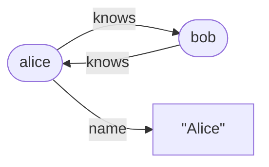

---
tags:
  - rdf
  - getting-started
---
<!-- provenance: exported 2026-07-24 from the private monorepo's newcomer-docs/foundations/rdf-in-five-minutes.md; links + citations adapted to this repo's layout -->

# RDF in five minutes

*Triples, quads, SPARQL, and the RDF4J Sail service provider interface — the domain the versioned and
flat stores plug into.*

> **What you'll learn** — just enough RDF to read the Sail code: what a triple
> and a quad are, what SPARQL asks for, and how Eclipse RDF4J's `Sail` service provider interface lets
> `prolly-port` slot a prolly tree in as a graph-database backend.
>
> _Reading time: ~8 minutes._

## Why it matters

Most of `prolly-port`'s modules — both Sails, the REST server, the domain
stores — speak **RDF**. If "subject/predicate/object", "named graph", and
"Sail" are not yet reflexes, the RDF-side code reads as noise. Five minutes
here makes it read as structure.

## The idea

### RDF — data as a graph of statements

RDF (Resource Description Framework) models data as a set of **statements**.
One statement is a **triple**: *subject — predicate — object*.

```
<http://ex.org/alice>  <http://schema.org/knows>  <http://ex.org/bob>
   subject                 predicate                  object
```

Read it as a sentence: *Alice knows Bob*. Each statement is one labelled,
directed edge. Many statements sharing identifiers form a **graph**:



The three positions take different things:

- **Subject** — an **IRI** (a global identifier, like a URL) or a **blank
  node** (a local, anonymous node — "some thing", no global name).
- **Predicate** — always an **IRI**; it names the relationship.
- **Object** — an IRI, a blank node, **or a literal** — a concrete value:
  `"Alice"`, `42`, `2026-05-19`. A literal carries a **datatype**
  (`xsd:integer`, `xsd:dateTime`, …) and a string literal may carry a
  **language tag** (`"hallo"@de`).

There is no separate schema step: the graph *is* the data and its shape.

### Quads — statements in a named graph

A triple says nothing about *which dataset* it belongs to. Add a fourth
component — the **context**, a.k.a. the **named graph** — and a triple becomes
a **quad**:

```
alice  knows  bob   <http://ex.org/graph/import-2026>
  s      p     o            context
```

Named graphs partition statements — by source, by version, by tenant. A
statement with *no* context belongs to the **default graph**. The Sails store
quads (subject, predicate, object, context); a plain triple is just a quad
whose context is the default graph.

> **Key idea** — everything is a **quad**. The 8-byte-`TermId` keys in both
> Sails encode four positions; "triple" just means "quad in the default
> graph". Mishandling the default-graph context is a classic source of bugs.

### SPARQL — asking the graph questions

**SPARQL** is RDF's query language. Its core is the **triple pattern**: a
triple with **variables** (`?name`) in place of some terms. A set of patterns
is a **Basic Graph Pattern**; the engine finds every way to bind the
variables so all patterns match real statements.

```sparql
SELECT ?friend WHERE {
  <http://ex.org/alice> <http://schema.org/knows> ?friend .
}
```

A pattern with all three positions as variables — `{ ?s ?p ?o }` — matches
*everything*. `SELECT` returns bindings; `CONSTRUCT` builds a new graph; `ASK`
returns true/false; a `GRAPH ?g { … }` block scopes patterns to named graphs;
**SPARQL Update** (`INSERT`/`DELETE`) writes. Each pattern, at the bottom,
becomes a call that asks the store *"give me the statements matching this"*.

### RDF4J and the Sail service provider interface

[Eclipse RDF4J](https://rdf4j.org/) is the Java framework this project builds
on. It gives you:

- a **model API** — `IRI`, `Literal`, `BNode`, `Value`, `Statement`, and a
  `ValueFactory` to mint them;
- a **Repository API** — `Repository` / `RepositoryConnection`, what
  applications use;
- and the storage **service provider interface**: the **`Sail`** — *Storage And Inference Layer* — the
  pluggable backend behind a repository.

A `Sail` hands out `SailConnection`s, and a connection is a small contract:

| Method | What it does |
|---|---|
| `getStatements(s, p, o, contexts…)` | Return statements matching a pattern — *the* read primitive. |
| `addStatement` / `removeStatement` | Write. |
| `evaluateInternal(...)` | Evaluate a SPARQL algebra expression. |
| `getContextIDs()` | List the named graphs. |
| `size(contexts…)` | Count statements. |
| `begin` / `commit` / `rollback` | Transaction boundaries. |

`SailRepository` wraps any `Sail`, and RDF4J's query engine drives every basic graph pattern by
calling `getStatements` on the connection.

> **Key idea** — implement the `Sail` service provider interface and *any* RDF4J application can use
> your storage with no code changes. That is exactly what `prolly-port` does:
> [`ProllySail`](../../prolly-rdf4j/README.md) (versioned) and `RocksDbFlatSail`
> (unversioned) are both just `Sail`s — a prolly tree wearing the RDF4J
> interface.

## The key types

| Type (RDF4J) | Role |
|---|---|
| `IRI`, `BNode`, `Literal` | The three kinds of RDF term; all are `Value`s. |
| `Statement` | A subject/predicate/object (+ optional context) quad. |
| `ValueFactory` | Mints `Value`s and `Statement`s. |
| `Sail` / `SailConnection` | The storage service provider interface `prolly-port` implements. |
| `SailRepository` | Wraps a `Sail` as a normal RDF4J `Repository`. |

## Rules & gotchas

- > **Gotcha** — a `null` context is **not** "any graph". Per the RDF4J
  > contract it denotes the default graph *specifically*. The Sails track it
  > under a `TermId.ZERO` sentinel; conflating it with "unbound" leaks named
  > graphs into the default graph — a bug this project has actually hit.
- > **Gotcha** — literals are typed. `"30"` (`xsd:integer`) and `30` written as
  > an `xsd:int` are *different* terms and will not match each other.
- The store thinks in quads and `TermId`s, not strings — see
  [A2 · a term](../anatomy/A2-a-term.md) for how a `Value` becomes a `TermId`.

## Takeaways

- RDF data is a graph of **statements**; a statement is a **triple** (s, p, o),
  or a **quad** once you add a named-graph **context**.
- Subjects/predicates are IRIs (or blank nodes for subjects); objects may also
  be typed **literals**.
- **SPARQL** queries by **triple patterns with variables**; every pattern
  bottoms out in a `getStatements` call.
- RDF4J's **`Sail`** service provider interface is the seam: implement it and any RDF4J app gets your
  backend. `ProllySail` and `RocksDbFlatSail` are that implementation.

## Where this lives

- `prolly-rdf4j/src/main/java/com/earasoft/prolly/rdf4j/sail/ProllySail.java` —
  the versioned `Sail`
- `prolly-flatsail/src/main/java/com/earasoft/prolly/flatsail/RocksDbFlatSail.java`
  — the unversioned `Sail`
- RDF4J model & service provider interface: external —
  [rdf4j.org](https://rdf4j.org/documentation/)
- Continues in: [A1 · a scan](../anatomy/A1-a-scan.md),
  [A2 · a term](../anatomy/A2-a-term.md),
  [A4 · a SPARQL query](../anatomy/A4-a-sparql-query.md)
