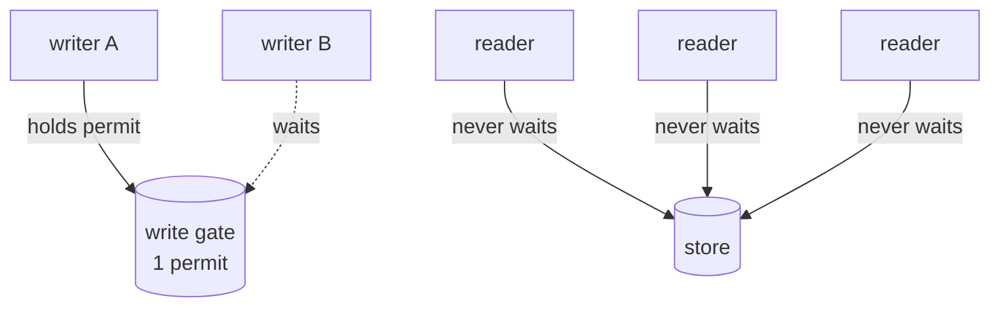

---
tags:
  - concurrency
---
<!-- provenance: exported 2026-07-24 from the private monorepo's newcomer-docs/foundations/the-concurrency-model.md; links + citations adapted to this repo's layout -->

# The concurrency model

*One writer at a time, many readers always — and why an immutable tree makes
snapshot isolation almost free.*

> **What you'll learn** — how the Sails let many threads read while serializing
> writers, why the write gate is a `Semaphore` and not a `ReentrantLock`, and
> how each connection gets a stable snapshot of the data — by buffering
> (`RocksDbFlatSail`) or by forking immutable tree roots (`ProllySail`).
>
> _Reading time: ~9 minutes._

## Why it matters

An RDF4J `Sail` is handed out to many threads at once. The `SailConnection`
contract still demands sane behaviour: a reader must not see a half-applied
write, a writer's transaction must be all-or-nothing, and a connection must see
its own writes. Getting that wrong produces the worst kind of bug — one that
passes every single-threaded test and corrupts data only under load.

`prolly-port`'s answer is deliberately simple: **single-writer, multi-reader**.
At most one write transaction mutates the store at a time; reads never block
and never wait. Simple is a feature here — it is small enough to reason about
and to test exhaustively.

## The idea

### Why one writer

The constraint is **not** RocksDB's — RocksDB is fully concurrent, and even ships
transactional variants (`OptimisticTransactionDB`) with built-in conflict detection.
Single-writer is *our* choice, forced by shared state that two writers would each
modify from a stale view:

- **The term dictionary.** Every RDF term is interned to a small integer `TermId` in
  a dictionary shared by the whole repository. A transaction sees only committed
  state plus its own buffer, so two writers interning the *same* new term each assign
  it a *different* id — commit both and the term-to-id mapping is corrupt (two ids for
  one term, a rewound id counter on restart).
- **Copy-on-write roots (`ProllySail`).** Both writers fork from the same root and
  advance a single root pointer on commit; last-writer-wins silently drops the loser's
  whole subtree.

The gate dissolves both: serialized writers each fork from the *previous* one's
**committed** state. It is the stand-in for write-write conflict detection we chose not
to buy — a RocksDB `OptimisticTransactionDB`, or a compare-and-set rebase on the prolly
side (future work).

### The write gate

Each Sail owns one **fair counting semaphore with a single permit**:

```java
// RocksDbFlatSail
private final Semaphore writeLock = new Semaphore(1, true);
```

A write transaction acquires that permit — **lazily, on its first mutation** —
and holds it until commit or rollback. A second writer simply waits. Readers
*never* touch the semaphore, so any number of them proceed concurrently with
each other and with the one active writer.

> **Gotcha — why a `Semaphore`, not a `ReentrantLock`.** A `ReentrantLock` can
> only be released by the exact thread that acquired it. But a Sail's acquire
> and release legitimately happen on *different* threads — RDF4J may run a
> connection's `commit` on one thread and `shutDown` it from another. A
> `ReentrantLock` there either throws on release or silently leaks the lock
> forever. A counting `Semaphore` has **no owner thread**: whoever holds the
> logical transaction can release it. This is not a stylistic choice — it
> fixed a real lock-leak-and-hang bug.

The semaphore is **fair** (`true`): writers are served first-come-first-served,
so a steady stream of writers cannot starve a waiting one.



### Isolation — two mechanisms, one guarantee

A reader must see a *consistent* view. The two Sails reach that differently.

**`RocksDbFlatSail` — buffer the writer.** A write transaction accumulates its
changes in a RocksDB `WriteBatchWithIndex` — an in-memory batch that is *also*
queryable. The connection's own reads merge that batch over committed RocksDB
state, so the writer sees its own uncommitted writes (read-your-writes).
`commit()` applies the whole batch in one atomic `db.write`; until then, *other*
connections see none of it. Isolation = the writer's changes are invisible
until they land all at once.

**`ProllySail` — fork an immutable snapshot.** This is where
[the prolly tree](https://github.com/prollygraph/prolly-core/blob/main/docs/foundations/the-prolly-tree.md) pays off. The Sail holds only the
**committed** tree roots, in `volatile` fields:

```java
private volatile StaticMap dictRoot;
private volatile StaticMap namespacesRoot;
// ... one per index/table
```

When a connection starts a transaction it **forks** those roots — captures the
current root references into its own per-connection tables (a `Snapshot`).
Because every prolly-tree root names a *complete, immutable* tree, that
captured root keeps pointing at exactly the data it named — forever, even after
someone else commits a new root. The connection reads its snapshot; a committing
writer advances the Sail's `volatile` roots to new immutable trees; the two
never interfere.

> **Key idea** — content addressing gives you MVCC for free. An old root is not
> "stale data to be cleaned up" — it is a permanently valid, immutable tree. A
> reader holding it has a perfect point-in-time snapshot at zero locking cost.
> Time-travel queries are the same mechanism, pointed at an older root on
> purpose.

`commit` advances the Sail's roots; the rule is **first-to-commit-wins**, and a
connection whose snapshot is out of date must retry its `begin`.

### Where RDF4J's isolation levels fit

RDF4J lets each transaction request an `IsolationLevel` — a ladder from `NONE` up
through `READ_COMMITTED` and `SNAPSHOT` to `SERIALIZABLE` — and `ProllySail`
advertises the standard levels (`ProllySailIsolationLevelTest` runs RDF4J's own
`SailIsolationLevelTest`, which probes each advertised level for dirty reads,
non-repeatable reads, lost updates, and so on).

The point to grasp is that **the architecture already supplies most of what the high
levels ask for, so the level you request changes surprisingly little**:

- **Serialized writers ⇒ no write-write anomalies.** The strong levels exist to rule
  out lost updates and write skew between *concurrent* writers. The write gate means
  there are none — writers are serialized — so those anomalies cannot arise at any
  level.
- **Snapshot reads ⇒ no dirty or non-repeatable reads.** A reader forks the committed
  roots (or merges its own buffer) and reads that fixed snapshot, so it never observes
  another transaction's uncommitted or mid-flight state, whatever level it asked for.
  Content addressing makes that snapshot free (the key idea above).

So a read effectively gets snapshot-grade isolation and a write gets a serialized
commit *regardless* of the requested level — the concurrency is set by the write gate
and the snapshot fork, not by the level dial.

The one level that genuinely changes behaviour is **`NONE`**: it trades the guarantees
for speed, and under it rollback is *not* promised to undo. (The differential test
harness deliberately avoids `NONE` for exactly this reason — a no-undo rollback makes
`ProllySail` and the `MemoryStore` reference legitimately disagree.) So here a level is
mostly a *rollback-and-buffering* contract, not a concurrency dial.

> **Pinned (Step 14) — and now an honest advertisement.** "Advertised" used to differ from
> "honoured" in a literal way: the Sail inherited `AbstractSail`'s default of
> `[READ_UNCOMMITTED, SERIALIZABLE]` with a default level of `READ_COMMITTED` that *wasn't even a
> member of that set*. `ProllySail` now overrides the advertisement to the full standard ladder with
> a default of `SNAPSHOT` (a member of the set), and `ProllySailIsolationLevelHonestyTest` pins it as
> a fixed contract — so RDF4J's `SailIsolationLevelTest` probes exactly that ladder, all ten checks
> green. It is honest because the runtime *doesn't branch on the level* (every transaction takes the
> same snapshot fork), so the Sail satisfies every advertised level by always delivering
> serializable-grade isolation; the level is metadata, not a behaviour dial.

## The key types

| Type | Role |
|---|---|
| `Semaphore` (`writeLock` in `RocksDbFlatSail` / `ProllySail`) | The single-permit, fair, owner-less write gate. |
| `WriteBatchWithIndex` | `RocksDbFlatSail`'s queryable write buffer — isolation + read-your-writes. |
| `StaticMap` (the `volatile *Root` fields) | `ProllySail`'s committed, immutable tree roots; advanced atomically per commit. |
| `Snapshot` / per-connection tables | A connection's forked, stable view of the roots at `startTransaction`. |

## Rules & gotchas

- > **Gotcha** — single-writer is a stated **v2.0 assumption**. The gate
  > serializes write *transactions*; the Sail's root-advance step is not
  > additionally hardened against a second concurrent writer. Don't remove the
  > gate expecting correctness to hold.
- > **The core root snapshot is published atomically.** A `ProllySail`'s four core
  > roots (dict, the four index roots, namespaces, stats) are republished as ONE
  > immutable `Snapshot` behind a single volatile after every advance, and a
  > connection's *constructor* forks that one reference — so a read opened at the
  > moment another connection commits sees a whole consistent snapshot, never a torn
  > mix of two commits' roots. This was once a latent race (the constructor forked the
  > roots one field at a time, lock-free); the story + the design (and why the
  > provenance / event-sink sidecar roots stay a smaller residual) is in
  > `prollysail-root-publication-race` *(private monorepo work tracker)*.
- > **Gotcha** — a connection's snapshot is, by design, its *start-of-transaction*
  > view. To keep within-transaction read-your-writes correct, the Sail
  > flushes pending writes before serving a read on the same connection — a
  > subtlety that was once a bug.
- > **Trade-off** — single-writer caps write throughput at one transaction's
  > worth of work at a time. The project takes that for a model small enough to
  > verify; bulk loads are expected to chunk into many small transactions.
- Never reintroduce a `ReentrantLock` for the write gate. The cross-thread
  acquire/release is intentional and the `Semaphore` is what makes it sound.

## Takeaways

- The model is **single-writer, multi-reader**: one fair `Semaphore` permit
  gates writers; readers never wait.
- The gate is a `Semaphore`, not a `ReentrantLock`, precisely because acquire
  and release can occur on different threads.
- `RocksDbFlatSail` isolates by buffering the writer in a `WriteBatchWithIndex`
  and applying it atomically; `ProllySail` isolates by forking immutable tree
  roots into a per-connection snapshot.
- Immutable, content-addressed trees make snapshot isolation and time-travel
  the *same* cheap mechanism — an old root is always a valid tree.

## Where this lives

- `prolly-flatsail/src/main/java/com/earasoft/prolly/flatsail/RocksDbFlatSail.java`
  — the `Semaphore` write gate
- `prolly-flatsail/src/main/java/com/earasoft/prolly/flatsail/RocksDbFlatSailConnection.java`
  — lazy `acquireWriteLock`, `WriteBatchWithIndex` isolation
- `prolly-rdf4j/src/main/java/com/earasoft/prolly/rdf4j/sail/ProllySail.java`,
  `ProllySailConnection.java` — `volatile` roots, snapshot fork, commit
- Concurrency test plan: `11-concurrency-lock-testing` *(private monorepo work tracker)*
- Builds on: [the-prolly-tree](https://github.com/prollygraph/prolly-core/blob/main/docs/foundations/the-prolly-tree.md)
- Continues in: [the-go-port](https://github.com/prollygraph/prolly-core/blob/main/docs/foundations/the-go-port.md)
- Deeper, a different lock: read-write-locks *(private monorepo advanced-topics doc)*
  — the `Database`-layer `gcLock` (garbage-collection vs. writers), the boundary bug,
  and when to reach for a read-write lock.
