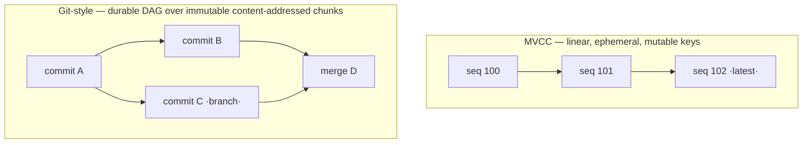

---
tags:
  - versioning
  - concurrency
---
<!-- provenance: exported 2026-07-24 from the private monorepo's newcomer-docs/foundations/versioning-vs-mvcc.md; links + citations adapted to this repo's layout -->

# Versioning vs. MVCC

*Why git-style history needs content-addressed immutability — not a database's multi-version reads.*

> **What you'll learn** — The store sits on RocksDB, which has snapshots and sequence numbers (its own
> multi-version concurrency control). It is natural to assume that versioning could come "for free" from that
> machinery. It can't — and the reason is the whole reason prolly trees exist. This doc draws the line between
> *MVCC* (consistent reads of recent state) and *git-style versioning* (a durable branching history you can
> diff, merge, and sync), and shows which one the codebase gets from where.
>
> _Reading time: ~8 minutes._

## Why it matters

Look at the stack and a tempting shortcut appears. Underneath everything is RocksDB, and RocksDB is a
multi-version store: every write gets a monotonic sequence number, and a *snapshot* lets a reader see a
consistent view as of some sequence number. That smells like versioning. So why does prolly-port carry a
whole content-addressed Merkle tree on top — the [prolly tree](https://github.com/prollygraph/prolly-core/blob/main/docs/foundations/the-prolly-tree.md), the
[chunk store](../the-chunk-store.md), commit logs, diff and merge engines — instead of just exposing RocksDB
snapshots as "commits"?

Because "versioning" means two different things, and the database mechanism gives you the wrong one. Knowing
the difference saves you from a whole class of wrong instincts — "let's just pin a snapshot," "let's key by
`(row, version)`," "let's use the sequence number as the commit id." Each of those rebuilds a worse database
and never reaches *git for data*.

## The idea

There are two philosophies of "remembering the past," and they are not interchangeable:

- **Mutable + multi-version (MVCC).** Keys are mutable; the store keeps a few *recent* versions, tagged by a
  sequence number, so readers don't block writers and a snapshot reads a consistent instant. The history is
  **linear** (sequence numbers are a total order), **ephemeral** (snapshots are in-memory handles, gone on
  restart; old versions are reclaimed by compaction the moment no snapshot pins them), and exists for
  **concurrency**.
- **Immutable + content-addressed (git / prolly).** Nothing is ever overwritten. Each unit of data is named
  by the hash of its own bytes; a "version" is a **root** that points into a shared, immutable set of
  content-addressed chunks. History is a **durable branching directed acyclic graph**, and because everything is named by
  content you get **O(differences) diff**, structural sharing, three-way merge, and chunk-level sync.

The leap from the first to the second *is* content-addressing. You cannot reach a branching, diffable,
syncable history by keeping more versions of mutable keys — you reach it by making data immutable and naming
it by content. That is what a prolly tree is.



> **Key idea** — MVCC versions *mutations*; prolly versions *content*. Only the second is a history you can
> branch, diff, merge, and sync.

## The key types

Git-style versioning in this codebase is assembled from these, none of which is RocksDB's MVCC:

| Type | Responsibility |
|---|---|
| [`NodeStore`](https://github.com/prollygraph/prolly-core/blob/main/dolthub-java-port/src/main/java/com/dolthub/prolly/NodeStore.java) / [`RocksNodeStore`](https://github.com/prollygraph/prolly-core/blob/main/prolly-storage/src/main/java/com/earasoft/prolly/storage/RocksNodeStore.java) | The **content-addressed, write-once** chunk store: `write(bytes)` returns the *content hash*; `read(hash)` returns the bytes. A hash maps to one immutable value, forever. |
| A prolly **root** (a `StaticMap` root hash) | A version. A commit *is* a set of root hashes over the shared chunk set. |
| [`CommitLog`](../../prolly-rdf4j/src/main/java/com/earasoft/prolly/rdf4j/sail/CommitLog.java) + refs | The **directed acyclic graph** — commits, their parents, and the branch pointers. This is the structure RocksDB sequence numbers cannot be (they're linear). |
| [`DiffEngine`](https://github.com/prollygraph/prolly-core/blob/main/dolthub-java-port/src/main/java/com/dolthub/prolly/DiffEngine.java) | **O(differences)** diff between any two roots — skip equal subtrees by hash. |
| [`MergeEngine`](https://github.com/prollygraph/prolly-core/blob/main/dolthub-java-port/src/main/java/com/dolthub/prolly/MergeEngine.java) | **Three-way structural merge** (both branches diffed against the common ancestor). |
| [`GarbageCollector`](https://github.com/prollygraph/prolly-core/blob/main/prolly-storage/src/main/java/com/earasoft/prolly/GarbageCollector.java) | Reclaims chunks no live root reaches — the *only* way content leaves the store (never an overwrite). |

The chunk store's whole contract is two methods, and they are the content-addressing in miniature:

```java
// prolly-core:dolthub-java-port/src/main/java/com/dolthub/prolly/NodeStore.java
Optional<MemorySegment> read(byte[] hash);
// Stores data and returns its content hash.
byte[] write(MemorySegment data);
```

`write` does not take a key — the key *is* the hash of the value. There is no "update key K"; there is only
"store these bytes, here is their name." That single design choice is what makes two commits share every
unchanged subtree (same content → same hash → one copy), what makes diff skip equal subtrees, and what lets
two repositories sync by exchanging only the hashes the other lacks.

## Rules & gotchas

- > **The store is on RocksDB, but its MVCC is idle here.** Because chunks are immutable and keyed by their
  > own hash, a key is never overwritten with a different value — so RocksDB's multi-version machinery has
  > nothing to version. RocksDB is used as a durable, dumb key→value store; the versioning lives entirely in
  > the prolly roots above it. Reaching down to RocksDB snapshots for "commits" would be reaching into a
  > mutable-key concurrency mechanism to do a job the immutable layer already does better.
- > **There *is* an MVCC in prolly-port — but it's for concurrency, not history.** The Sail publishes its
  > roots as one immutable `publishedSnapshot` so readers are lock-free and never block writers (see
  > [the concurrency model](the-concurrency-model.md)). That is multi-version *concurrency* over prolly
  > versions; it is not what makes the history durable or branchable. Don't conflate the two — concurrency is
  > the `publishedSnapshot`; *history* is the `CommitLog` directed acyclic graph over immutable chunks.
- > **Gotcha — time-travel reads ≠ versioning.** Many stores (RocksDB snapshots, Datomic, SQL:2011 temporal
  > tables) give you "read the state as of time T." That is the *easy* half. Branching, three-way merge, and
  > content-addressed sync between *arbitrary* points are the half that needs the Merkle directed acyclic graph, and no amount of
  > extra retained versions gets you there.
- > **Trade-off — content-addressing isn't free; you pay at write time.** The price of O(diff) / sync / merge
  > is that each commit must (re)build the content-addressed tree so its root has a stable hash. That build is
  > the write-path cost the bulk-load work *(private monorepo work tracker)* wrestles with (the per-commit
  > spine rebuild, and why a bulk load wants to *presort and build once*). MVCC has no such write cost — and
  > also none of the payoff.

## Takeaways

- **MVCC versions mutations; prolly versions content.** They answer different questions; only the second is
  *git for data*.
- The leap from "multi-version reads" to "branching, diffable, syncable history" **is content-addressing** —
  the defining move of a prolly tree, not an add-on.
- prolly-port already uses RocksDB the right way: a **write-once content-addressed chunk store**, with the
  versioning in the prolly roots above — RocksDB's own MVCC is structurally unused for history.
- The proof by precedent: **Dolt** (the system this ports) is "git for data," and it is built on prolly
  trees, *not* on a database's MVCC — because MVCC can't branch, merge, diff, or sync.
- A second multi-version mechanism (`publishedSnapshot`) exists for **read concurrency** — keep it mentally
  separate from the *history*.

## Where this lives

- `prolly-core:dolthub-java-port/src/main/java/com/dolthub/prolly/NodeStore.java` — the content-addressed write-once store contract (`write` returns the hash).
- `prolly-storage/src/main/java/com/earasoft/prolly/storage/RocksNodeStore.java` — the RocksDB-backed chunk store; RocksDB as a dumb immutable key→value store.
- `prolly-core:dolthub-java-port/src/main/java/com/dolthub/prolly/DiffEngine.java` — O(differences) diff between roots.
- `prolly-core:dolthub-java-port/src/main/java/com/dolthub/prolly/MergeEngine.java` — three-way structural merge.
- `prolly-rdf4j/src/main/java/com/earasoft/prolly/rdf4j/sail/CommitLog.java` — the commit directed acyclic graph.
- `prolly-storage/src/main/java/com/earasoft/prolly/GarbageCollector.java` — reachability-based reclamation (content leaves only by the garbage collector, never overwrite).
- Read first: [the prolly tree](https://github.com/prollygraph/prolly-core/blob/main/docs/foundations/the-prolly-tree.md), [the chunk store](../the-chunk-store.md), [structural sharing & churn](structural-sharing-and-churn.md).
- Closely related: [the concurrency model](the-concurrency-model.md) — the *other* multi-version mechanism (`publishedSnapshot`), which is concurrency, not history.
